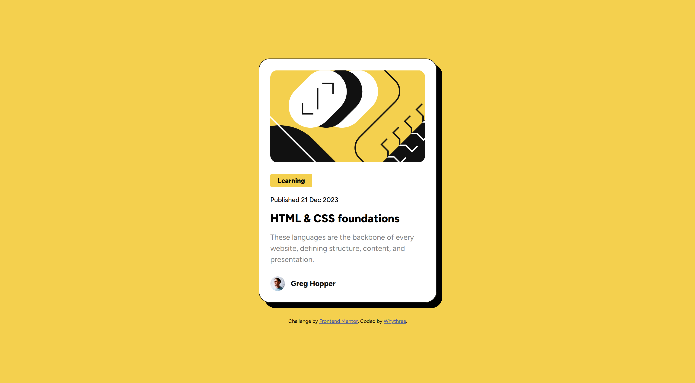

# Frontend Mentor - Blog preview card solution

## Table of contents

- [Overview](#overview)
  - [The challenge](#the-challenge)
  - [Screenshot](#screenshot)
  - [Links](#links)
- [My process](#my-process)
  - [Built with](#built-with)
  - [What I learned](#what-i-learned)
- [Author](#author)


## Overview

### The challenge

Users should be able to:

- See hover and focus states for all interactive elements on the page

### Screenshot




### Links

- Solution URL: [Add solution URL here](https://your-solution-url.com)
- Live Site URL: [Add live site URL here](https://your-live-site-url.com)

## My process

### Built with

- HTML5
- CSS

### What I learned

I have coded this project on my laptop, that I have just installed Linux Mint on. The computer is very weak, so I had use a simpler workflow and editor, than I normally use. Thanks to that, I got more comfortable using git from the terminal, learnt about sublime text, it`s plugins and shortcuts.

It has been a while since I had to write css, so refreshing on transitions and selectors like hover, was nice

```css
.container {
	width: 100%;
	max-width: 384px;
	padding: 1.5rem;
	background-color: var(--white);
	border:1px solid var(--black);
	border-radius: 1.5rem;
	box-shadow: 12px 12px 0px 0px #000000;

	transition: box-shadow 0.2s ease, color 0.2s ease;
}

.container:hover {
	box-shadow: 16px 16px 0px 0px #000000;
	cursor: pointer;
}

.container:hover h1 {
	 color: var(--primary);
}
```


I also was able to use variables, like I have seen it from other users, which made development easier. 

```css
:root {
	--primary:hsl(47, 88%, 63%);
	--white:hsl(0, 0%, 100%);
	--grey:hsl(0, 0%, 50%);
	--black:hsl(0, 0%, 7%);

	--font-size-small:clamp(0.9rem, 1.5vw + 0.5rem, 1rem);
}
```


## Author

- Frontend Mentor - [@Whythree](https://www.frontendmentor.io/profile/Whythree)

